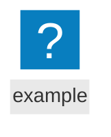
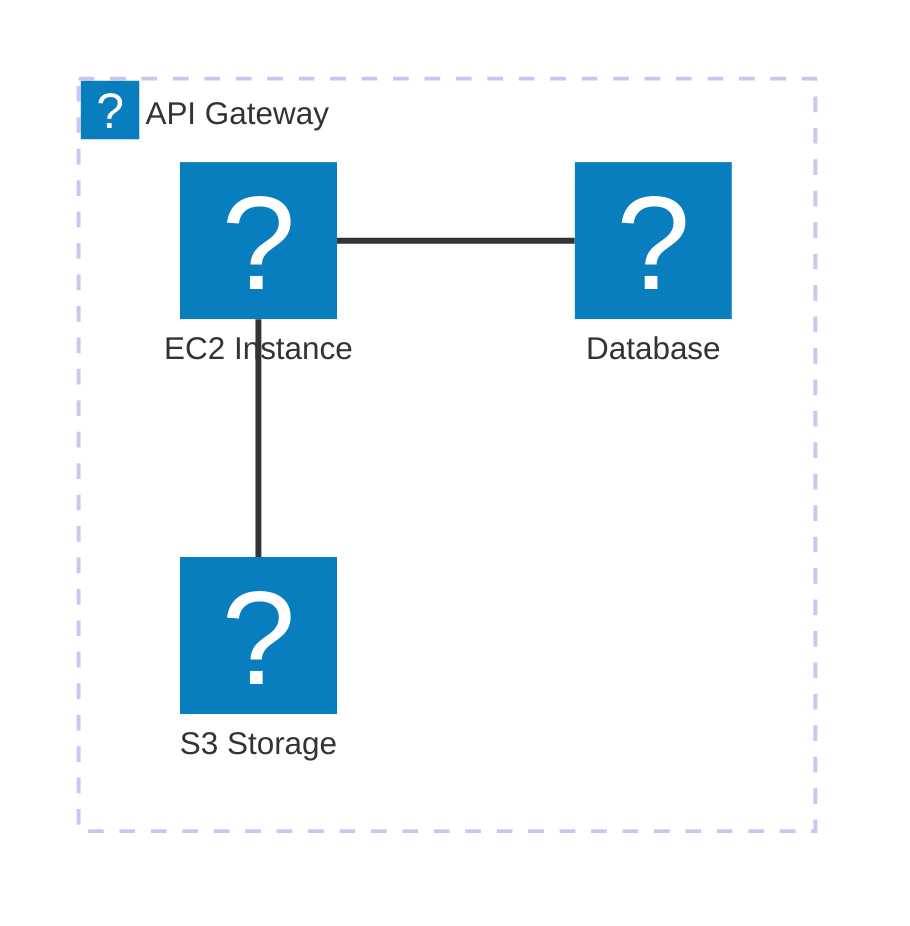

# CDK-TS-EXAMPLES

```mermaid
flowchart
    n1["example"]
    n1@{ icon: "aws:arch-alexa-for-business"}
```

```mermaid
architecture-beta
   group api(aws:arch-amazon-api-gateway)[API Gateway]
   service db(aws:arch-amazon-rds)[Database] in api
   service storage(aws:arch-amazon-simple-storage-service)[S3 Storage] in api
   service compute(aws:arch-amazon-ec2)[EC2 Instance] in api
   db:L -- R:compute
   storage:T -- B:compute
```

@startuml
skinparam dpi 150

rectangle "Meu Sistema" {
  !includeurl 
}

@enduml